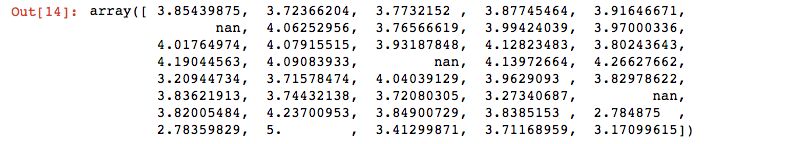

# Movie recommender
--------------------------

### Introduction

Collaborative Filtering is a recommendation algorithm that predicts user's preferences based on the ratings or behavior of other users. The assumption here is that if two users have similar opinions on one item then the two user's are likely to have the same opinion on a different item. 

This project uses an item based collaborative filtering approach to find similarities between items to predict user preferences. The dataset contains 100,000 ratings from 943 users on 1682 movies obtained from MovieLens.

### Project Overview:

1.) Read in the Data.

2.) Transform the dataset to a sparse matrix. The rows represent users and columns as movies.

3.) Create an item to item similarity matrix using cosine similarity.

4.) Sort the matrix from least to greatest similarity.

5.) Define a neighborhood size to represent the 'n' most similar items.

6.) Check for items rated by the user and if it is within the neighborhood size.

7.) Predict ratings for all users by weighing the similarity between the target item and other items user has rated.

8.) Calculate RMSE between predicted ratings and actual ratings from test set.

### Usage:

* Clone this repo.
* Go into the directory using 'cd Movie_recommender'.
* Run 'python item_based_recc.py'.

### Results:
The evaluation metric used for this project is Root Mean Squared Error.

For validation, a disjoint test set of 10 ratings per user was used.

The following score was obtained:

RMSE: 1.06

The results from this experiment reveal that a item-based collaborative filtering engine performs fairly well when attempting to predict user preferences. This method is especially effective when there are many more users than items because more user's means more ratings for items. Furthermore, rating distributions tend to be much more stable than user profiles which change frequently, requiring the entire model to be retrained. 

A downside of this method is when we cannot find high similarity items between the items the user has rated and the target item. As shown in the picture below, when similar items within the neighborhood size cannot be found, the resulting prediction becomes nan due to the weighted sum calculation not being able to find appropriate similarities. In this approach nans are  filled with zeros since we dont have enough information to provide an accurate prediction rating for that particular item. One solution is to further experiment with the neighborhood size or different measurements of similarity which could lead to more optimal results.

### Future Work

* Experiment with different neighborhood sizes and measure performance differences.

* Attempt different distance measures such as Person's Correlation and adjusted cosine similarity.

### References:

[1] https://ashokharnal.wordpress.com/2014/12/18/worked-out-example-item-based-collaborative-filtering-for-recommenmder-engine/
